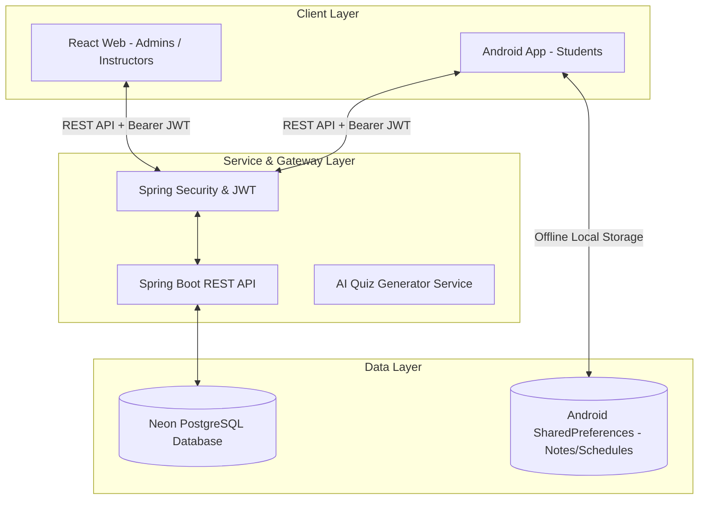
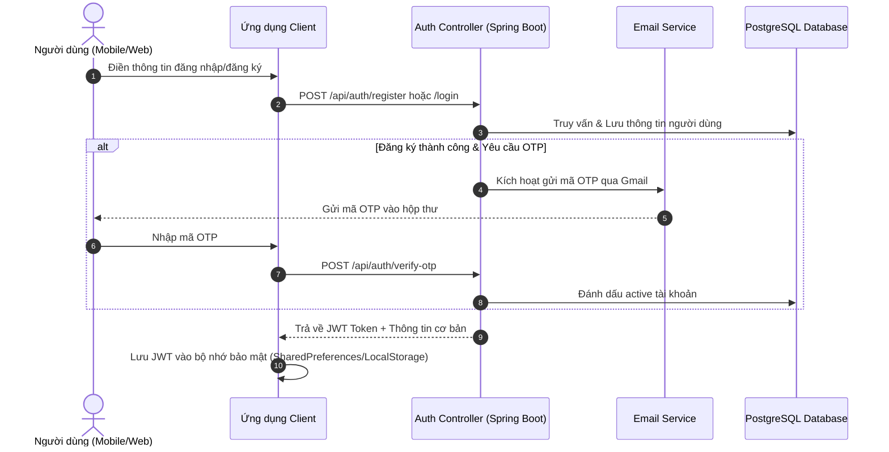
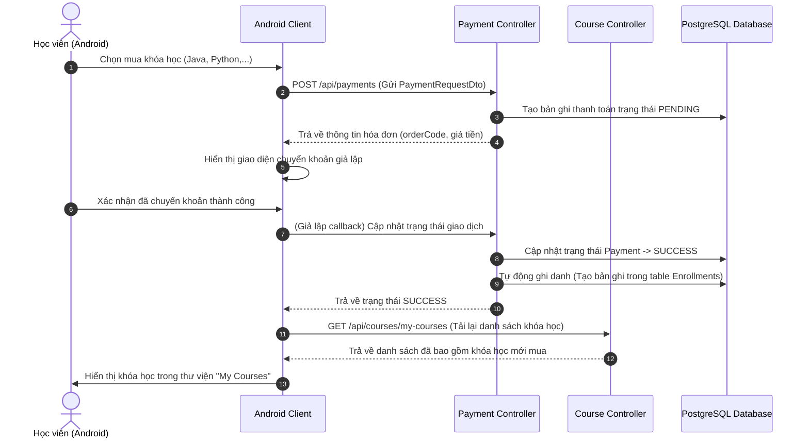
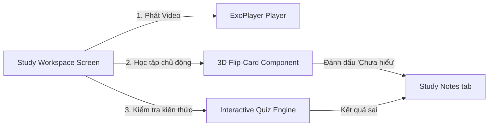
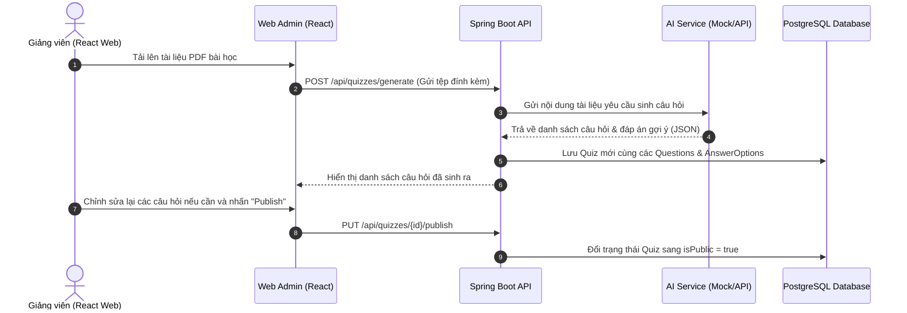

# Cẩm Nang Quy Trình Hoạt Động & Nghiệp Vụ Hệ Thống Learnverse V2

Tài liệu này trình bày chi tiết về kiến trúc hệ thống, luồng xử lý nghiệp vụ cốt lõi, và sự tương tác qua lại giữa ba thành phần chính của dự án Learnverse V2: **Backend (Spring Boot)**, **Mobile Client (Android Jetpack Compose)**, và **Admin/Instructor Web (React + Vite)**.

---

## 1. Tổng Quan Kiến Trúc Hệ Thống (System Architecture)

Hệ thống hoạt động theo mô hình **Client-Server** kết hợp cơ chế lưu trữ ngoại tuyến tại chỗ (Offline-First) trên ứng dụng di động:

---

## 2. Các Quy Trình Nghiệp Vụ Cốt Lõi & Luồng Tương Tác

### Chức năng 1: Quy Trình Xác Thực (Authentication & Security)

Hệ thống sử dụng cơ chế xác thực không trạng thái (Stateless) dựa trên **JWT Token** kết hợp gửi mã xác thực **OTP qua Email** để khôi phục mật khẩu hoặc xác thực tài khoản.

> [!NOTE]
> Mọi yêu cầu HTTP gửi đến các tài nguyên được bảo vệ (sau đăng nhập) bắt buộc phải đính kèm Header:
> `Authorization: Bearer <JWT_TOKEN>`

---

### Chức năng 2: Đăng Ký Khóa Học & Quy Trình Thanh Toán (Payments & Enrollment)

Learnverse V2 hỗ trợ đăng ký và mua khóa học bằng hệ thống giả lập thanh toán (Mock Payment Gateway), tự động kích hoạt quyền học tập ngay khi giao dịch thành công.

---

### Chức năng 3: Không Gian Học Tập Tích Hợp (Course Study Workspace)

Nơi học viên tương tác trực tiếp với bài học, bao gồm: xem video bài học, làm thẻ ghi nhớ (Flashcards), và thực hiện các bài thi trắc nghiệm (Quizzes).

* **Video Player (ExoPlayer)**: Tự động tải luồng phát video từ bài học được chọn, giúp duy trì trạng thái phát ổn định.
* **3D Flip-Card**: Cho phép học viên lật thẻ ghi nhớ để xem đáp án/giải thích và đánh dấu thẻ ở trạng thái "Chưa hiểu". Trạng thái này lập tức được lưu vào danh mục **Ghi chú học tập** để ôn tập lại sau.

---

### Chức năng 4: Hệ Thống Ghi Chú & Lịch Trình Tương Tác Lịch Học (Advanced Notes & Google Calendar Sync)

Đây là chức năng quan trọng hỗ trợ lưu trữ Offline-First, hiển thị trực quan dạng Google Calendar và tự động kích hoạt báo thức/thông báo trên điện thoại.

#### Quy Trình Đồng Bộ & Xử Lý Sự Cố:
1. **Lưu trữ ngoại tuyến:** Khi học viên nhấn "Lưu", lịch trình sẽ được lưu ngay vào `SharedPreferences` cục bộ để đảm bảo tốc độ phản hồi tức thì và hỗ trợ sử dụng ngoại tuyến.
2. **Đồng bộ Server:** Ứng dụng gửi yêu cầu lưu từ xa qua API. Nếu Server trả về thành công, ID tạm thời (`"0"`) sẽ được thay thế bằng ID chính thức của cơ sở dữ liệu từ Server.
3. **Quản lý lịch nhắc nhở (Alarms):** Lịch trình được đăng ký trực tiếp với hệ điều hành Android qua `AlarmManager`. Khi đến đúng thời gian hẹn, hệ thống sẽ phát tín hiệu kích hoạt `BroadcastReceiver` và hiển thị thông báo đầu màn hình (Push Notification).
4. **Google Calendar View (Lịch biểu đánh dấu ngày):**
   * Hệ thống tự động phân loại các ngày có sự kiện và vẽ các chấm tròn màu sắc tương ứng dưới ô ngày đó (Đỏ = Quan trọng cao, Cam = Trung bình, Xám = Thấp).
   * Lọc thông minh: Nhấp vào một ngày cụ thể trên lưới lịch, danh sách ghi chú bên dưới sẽ lọc ra đúng các lịch trình tương ứng của ngày đó.

---

### Chức năng 5: Động Cơ Trắc Nghiệm AI & Quản Lý Bài Tập (AI Quiz Engine)

Giảng viên có thể tải lên tệp tài liệu tài nguyên bài giảng (PDF/TXT), hệ thống Web Admin sẽ gửi yêu cầu xử lý sang Backend để trích xuất nội dung và dùng mô hình AI tự động sinh câu hỏi trắc nghiệm.

---

## 3. Bản Đồ Tương Tác API & Thực Thể Dữ Liệu (API & Entity Mapping Matrix)

Bảng dưới đây thống kê mối tương quan giữa giao diện Người dùng, API Endpoint và các bảng thực thể được thao tác trong cơ sở dữ liệu PostgreSQL:

| Tên Chức Năng | API Endpoint (Backend) | Method | Giao Diện Tương Tác | Bảng CSDL Ảnh Hưởng |
| :--- | :--- | :--- | :--- | :--- |
| **Đăng nhập & Đăng ký** | `/api/auth/login` `/api/auth/register` `/api/auth/verify-otp` | POST | Màn hình Login, SignUp, Verify OTP | `users`, `user_profiles` |
| **Mua khóa học** | `/api/payments` | POST | Màn hình Chi tiết khóa học (Android) | `payments` |
| **Xem danh sách học** | `/api/courses/my-courses` | GET | Tab Home / Courses (Android) | `enrollments`, `courses` |
| **Xem bài học & Video**| `/api/courses/{id}/lessons` | GET | Màn hình Course Study Workspace | `lessons` |
| **Ghi chú bài học** | `/api/notes` | POST/GET | Giao diện ghi chú dưới video bài học | `notes` |
| **Lấy danh sách Quiz** | `/api/quizzes` | GET | Tab Trắc nghiệm học tập | `quizzes`, `questions` |
| **Làm bài Trắc nghiệm**| `/api/quizzes/{id}/start` `/api/quizzes/attempts/{id}/complete` | POST | Giao diện Quiz play | `quiz_attempts` |
| **Đồng bộ Lịch trình**| `/api/user-notes` | GET/POST | Tab Lịch trình (Android) | `user_notes` |
| **Tạo/Sửa Lịch trình** | `/api/user-notes/{id}` | PUT/DELETE | Nút dấu cộng mở rộng (FAB) / Lịch | `user_notes` |
| **Tạo Khóa học (GV)** | `/api/courses` | POST | Trang Instructor Dashboard (React Web) | `courses` |
| **Duyệt Khóa học (AD)**| `/api/courses/{id}/approve` | PUT | Trang Admin Dashboard (React Web) | `courses`, `notifications` |

---

## 4. Cơ Chế Bảo Mật & Phân Quyền (Security & Role Management)

Hệ thống quản lý phân quyền chặt chẽ trên Spring Security thông qua cột `role` trong thực thể `User` (`Role.ADMIN`, `Role.TEACHER`, `Role.STUDENT`):

* **Học viên (`STUDENT`)**: Có quyền xem các khóa học đã được phê duyệt (`APPROVED`), ghi danh học tập, thực hiện trắc nghiệm, tạo lịch trình cá nhân, và viết ghi chú.
* **Giảng viên (`TEACHER`)**: Có quyền tạo khóa học mới, tải bài giảng lên, sinh trắc nghiệm tự động bằng AI từ tài liệu bài giảng, và theo dõi danh sách học viên đăng ký.
* **Quản trị viên (`ADMIN`)**: Có toàn quyền hệ thống, phê duyệt hoặc từ chối các khóa học mới tải lên của giảng viên, quản lý tài khoản người dùng, và xem báo cáo thống kê doanh thu giao dịch.
