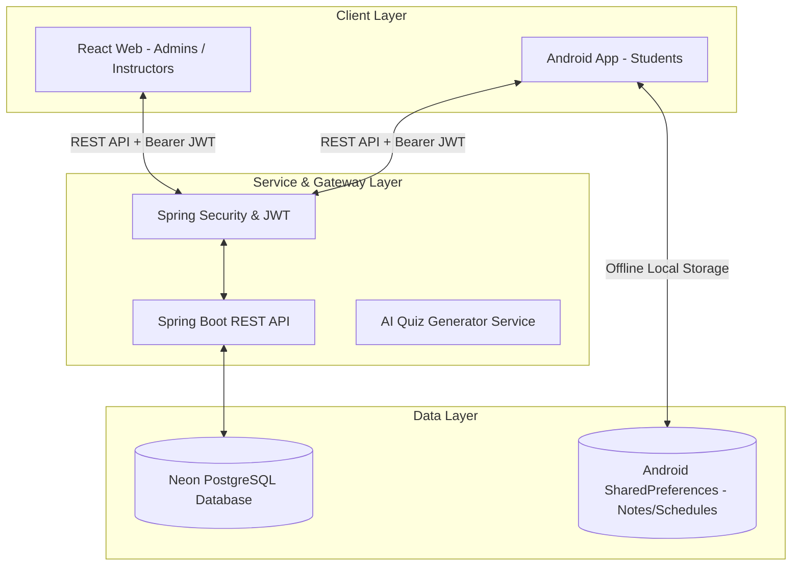
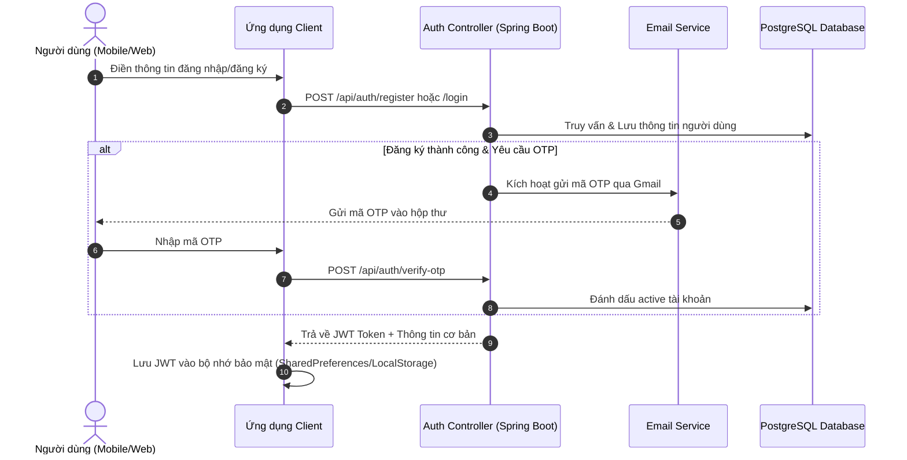
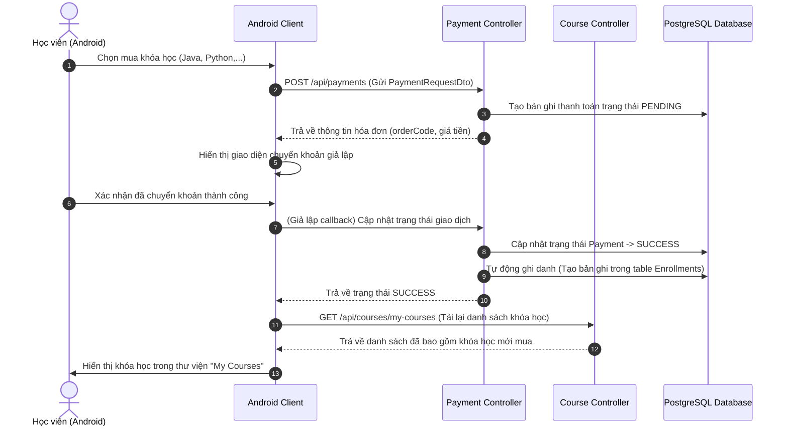
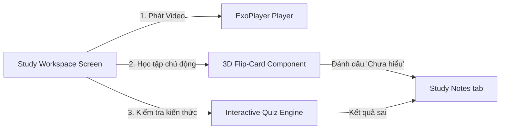
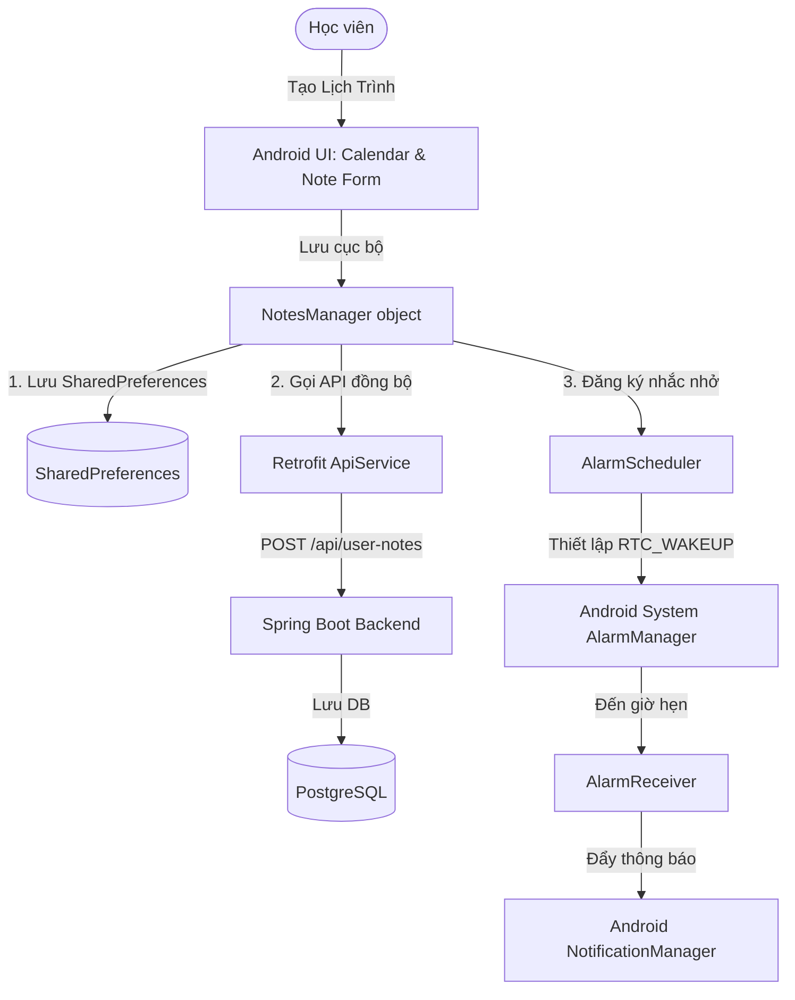
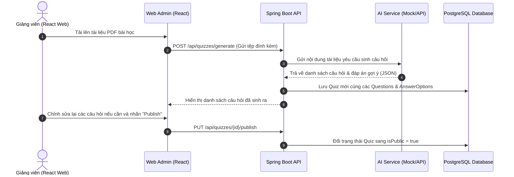

# Cẩm Nang Quy Trình Hoạt Động & Nghiệp Vụ Hệ Thống Learnverse V2

Tài liệu này trình bày chi tiết về kiến trúc hệ thống, luồng xử lý nghiệp vụ cốt lõi, và sự tương tác qua lại giữa ba thành phần chính của dự án Learnverse V2: **Backend (Spring Boot)**, **Mobile Client (Android Jetpack Compose)**, và **Admin/Instructor Web (React + Vite)**.

---

## 1. Tổng Quan Kiến Trúc Hệ Thống (System Architecture)

Hệ thống hoạt động theo mô hình **Client-Server** kết hợp cơ chế lưu trữ ngoại tuyến tại chỗ (Offline-First) trên ứng dụng di động:



---

## 2. Mô Tả Luồng Hoạt Động Chi Tiết Cho Từng Chức Năng

### Chức năng 1: Quy Trình Xác Thực (Authentication & Security)

Chức năng xác thực đảm bảo an toàn truy cập cho toàn bộ hệ thống bằng cơ chế Token JWT không trạng thái (Stateless), kết hợp gửi mã OTP xác minh qua Email khi đăng ký hoặc quên mật khẩu.



#### Các bước hoạt động chi tiết:
1. **Đăng ký Tài khoản mới:**
   * **Bước 1.1 (Client):** Người dùng nhập thông tin: Họ tên, Email, Mật khẩu trên giao diện `SignUpScreen` (Android) hoặc `RegisterPage` (React Web). Hệ thống kiểm tra định dạng email và độ mạnh của mật khẩu trước khi gửi đi.
   * **Bước 1.2 (Client -> Backend):** Gửi yêu cầu qua HTTP POST đến `/api/auth/register` đính kèm DTO chứa thông tin đăng ký.
   * **Bước 1.3 (Backend):** `AuthController` tiếp nhận và chuyển tiếp cho `AuthService`. Hệ thống thực hiện kiểm tra xem email đã tồn tại trong CSDL hay chưa thông qua `UserRepository`.
   * **Bước 1.4 (Backend):** Nếu email hợp lệ, mật khẩu được mã hóa bằng thuật toán `BCryptPasswordEncoder`. Một bản ghi `User` mới được tạo với `Role.STUDENT` (mặc định) và trạng thái `active = false`.
   * **Bước 1.5 (Backend):** Sinh ngẫu nhiên một mã OTP gồm 6 chữ số, lưu trữ tạm thời trong CSDL (bảng `otps` kèm thời gian hết hạn là 5 phút) và gọi `EmailService` để gửi thư chứa mã OTP đến địa chỉ email đăng ký của người dùng qua SMTP Server của Google Gmail.
   * **Bước 1.6 (Client):** Giao diện tự động chuyển sang màn hình **Xác thực OTP (Verify OTP)**.
   * **Bước 1.7 (User -> Client):** Người dùng kiểm tra hòm thư cá nhân, lấy mã OTP và nhập vào giao diện, nhấn nút "Xác thực".
   * **Bước 1.8 (Client -> Backend):** Gửi yêu cầu HTTP POST đến `/api/auth/verify-otp` kèm theo email và mã OTP đã nhập.
   * **Bước 1.9 (Backend):** Hệ thống đối chiếu mã OTP từ CSDL. Nếu mã chính xác và chưa quá thời gian hết hạn (5 phút), thuộc tính `active` của tài khoản `User` sẽ được cập nhật thành `true`. Xóa bản ghi OTP cũ. Trả về kết quả kích hoạt tài khoản thành công.

2. **Đăng nhập Hệ thống:**
   * **Bước 2.1 (Client):** Người dùng nhập Email và Mật khẩu trên màn hình đăng nhập (`SignInScreen` / `LoginPage`).
   * **Bước 2.2 (Client -> Backend):** Gửi yêu cầu HTTP POST đến `/api/auth/login`.
   * **Bước 2.3 (Backend):** `AuthService` truy vấn người dùng từ CSDL theo email. Kiểm tra xem tài khoản đã được kích hoạt (`active = true`) chưa. Sử dụng hàm `passwordEncoder.matches()` để đối chiếu mật khẩu đã nhập với mật khẩu đã băm trong cơ sở dữ liệu.
   * **Bước 2.4 (Backend):** Nếu thông tin chính xác, hệ thống sử dụng thư viện JWT để tạo ra chuỗi **JWT Access Token** ký bằng khóa bí mật (Secret Key). Token chứa các trường thông tin ẩn (Claims): `userId`, `email`, `role`.
   * **Bước 2.5 (Backend -> Client):** Trả về phản hồi HTTP 200 kèm theo JWT Token và thông tin cơ bản của người dùng (tên, avatarUrl, quyền hạn).
   * **Bước 2.6 (Client):** Client lưu trữ an toàn JWT Token vào bộ nhớ cục bộ (`SharedPreferences` trên Android hoặc `localStorage` trên Web). Mọi yêu cầu API gọi dữ liệu bảo mật sau này đều tự động đính kèm Header: `Authorization: Bearer <token>`.

---

### Chức năng 2: Đăng Ký Khóa Học & Quy Trình Thanh Toán (Payments & Enrollment)

Hệ thống cho phép học viên khám phá các khóa học và mua khóa học thông qua cổng thanh toán giả lập (Mock Payment Gateway), mở khóa quyền truy cập bài học ngay lập tức.



#### Các bước hoạt động chi tiết:
1. **Tạo yêu cầu mua khóa học:**
   * **Bước 1.1:** Học viên chọn một khóa học trả phí từ màn hình danh sách khóa học. Nhấn nút "Mua khóa học" trên màn hình chi tiết khóa học.
   * **Bước 1.2:** Android Client gửi yêu cầu HTTP POST đến `/api/payments` kèm theo JSON chứa `courseId` và giá tiền của khóa học.
   * **Bước 1.3:** `PaymentController` tiếp nhận yêu cầu. `PaymentService` sẽ tạo một thực thể `Payment` mới trong CSDL (bảng `payments`) với: trạng thái `PaymentStatus.PENDING`, tạo ngẫu nhiên một `orderCode` dựa trên Timestamp để làm mã giao dịch và liên kết bản ghi với thông tin `User` và `Course`.
   * **Bước 1.4:** API trả về thông tin hóa đơn gồm: `orderCode`, `amount` (số tiền), thông tin tài khoản đích giả lập.

2. **Thanh toán & Ghi danh:**
   * **Bước 2.1:** Android Client hiển thị giao diện thanh toán giả lập với các thông tin chuyển khoản (Số tài khoản, ngân hàng, mã giao dịch).
   * **Bước 2.2:** Sau khi học viên nhấn nút "Tôi đã chuyển khoản thành công", ứng dụng gửi một yêu cầu giả lập callback chuyển đổi trạng thái thanh toán đến `/api/payments/callback` hoặc `/api/payments/{orderCode}/success`.
   * **Bước 2.3:** Tại Backend, `PaymentService` cập nhật trạng thái của bản ghi `Payment` từ `PENDING` thành `SUCCESS` trong CSDL, đồng thời cập nhật trường `paidAt` bằng thời gian hiện tại.
   * **Bước 2.4:** Ngay sau khi thanh toán thành công, hệ thống tự động gọi `EnrollmentService` để tạo mới một bản ghi trong bảng `enrollments`. Bản ghi này ghi nhận việc học viên (`User`) đã chính thức đăng ký khóa học (`Course`), gán thuộc tính tiến độ học tập `progress = 0.0` và lưu thời gian ghi danh `enrollmentAt`.
   * **Bước 2.5:** Backend trả về trạng thái giao dịch thành công.
   * **Bước 2.6:** Android Client nhận được phản hồi thành công, tự động gọi API `GET /api/courses/my-courses` để cập nhật lại danh sách khóa học đã sở hữu của học viên, mở khóa và hiển thị nút "Học ngay" (Go Learning) trên màn hình chi tiết khóa học.

---

### Chức năng 3: Không Gian Học Tập Tích Hợp (Course Study Workspace)

Không gian học tập tích hợp mang đến giao diện học tập đa phương tiện và tương tác cao cho học viên, kết hợp video bài học, ghi chú tức thời và hệ thống ôn tập Flashcard 3D.



#### Các bước hoạt động chi tiết:
1. **Xem Video bài học:**
   * **Bước 1.1:** Học viên nhấn nút "Học ngay" từ màn hình khóa học. Ứng dụng Android điều hướng đến màn hình `CourseStudyWorkspace`.
   * **Bước 1.2:** Ứng dụng gọi API `GET /api/courses/{courseId}/lessons` để lấy toàn bộ danh sách bài học của khóa học sắp xếp theo chỉ số `orderIndex`.
   * **Bước 1.3:** Khi học viên chọn một bài học cụ thể, trình phát video **ExoPlayer** (thư viện truyền phát phương tiện của Google tích hợp trong Android) được khởi tạo. ExoPlayer nhận đường dẫn phát video (như liên kết YouTube hoặc Cloudinary) từ đối tượng `Lesson` và bắt đầu phát video bài học một cách mượt mà.
   * **Bước 1.4:** Hệ thống đồng thời gọi API `GET /api/notes?lessonId={lessonId}` để tải danh sách các ghi chú mà học viên đã ghi chép riêng cho bài học này lên giao diện hiển thị.

2. **Ghi chú bài học tại chỗ:**
   * **Bước 2.1:** Ngay bên dưới trình phát video, học viên có thể nhập nội dung ghi chú nhanh vào ô văn bản và nhấn nút "Lưu ghi chú".
   * **Bước 2.2:** Android Client gửi yêu cầu HTTP POST đến `/api/notes` kèm thông tin `lessonId` và `content`.
   * **Bước 2.3:** Backend lưu ghi chú mới vào bảng `notes` trong CSDL liên kết với học viên và bài học hiện tại. Sau đó phản hồi lại đối tượng vừa lưu. Giao diện ứng dụng di động lập tức cập nhật ghi chú mới vào danh sách hiển thị mà không cần tải lại toàn bộ trang.

3. **Học tập chủ động bằng thẻ ghi nhớ (Flashcards):**
   * **Bước 3.1:** Học viên nhấn tab "Flashcards" trong không gian học tập.
   * **Bước 3.2:** Ứng dụng hiển thị danh sách các thẻ khái niệm/định nghĩa cốt lõi của bài học đó dưới dạng thẻ hình ảnh trực quan.
   * **Bước 3.3:** Khi học viên chạm vào thẻ, Jetpack Compose thực hiện hiệu ứng hoạt ảnh xoay 3D (lật quanh trục Y 180 độ) để chuyển đổi từ mặt trước (câu hỏi/thuật ngữ) sang mặt sau (đáp án/giải nghĩa).
   * **Bước 3.4:** Nếu học viên cảm thấy chưa nắm vững nội dung của thẻ, học viên nhấn nút "Chưa hiểu". Ứng dụng Android sẽ tự động gọi hàm tạo ghi chú từ xa của `NotesManager` để lưu định nghĩa của thẻ đó vào mục ghi chú cá nhân với định dạng loại ghi chú là `FLASHCARD` để học viên dễ dàng ôn tập tập trung sau này.

---

### Chức năng 4: Hệ Thống Ghi Chú & Lịch Trình Tương Tác Lịch Học (Advanced Notes & Google Calendar Sync)

Chức năng quản lý ghi chú và lập lịch trình học tập cho phép lưu trữ ngoại tuyến tại chỗ (Offline-First), đồng bộ đám mây tự động khi có mạng, hiển thị lịch dạng Google Calendar và tạo báo thức nhắc nhở trên thiết bị Android.



#### Các bước hoạt động chi tiết:
1. **Lập lịch trình học tập mới:**
   * **Bước 1.1:** Học viên mở tab **Lịch trình** trên giao diện chính `HomeScreen`.
   * **Bước 1.2:** Nhấn nút FAB hình dấu cộng mở rộng chọn biểu tượng cuốn sổ/lịch. Giao diện hiển thị hộp thoại tạo lịch trình học tập.
   * **Bước 1.3:** Học viên nhập các thông tin: Tiêu đề lịch học, nội dung chi tiết, chọn mức độ quan trọng (`HIGH` - Đỏ, `MEDIUM` - Cam, `LOW` - Xám).
   * **Bước 1.4:** Học viên nhấn chọn ngày học (hiển thị `DatePickerDialog`) và giờ học cụ thể (hiển thị `TimePickerDialog`). Đồng thời có thể tích chọn nút "Bật thông báo nhắc nhở". Nhấn nút "Lưu".

2. **Xử lý lưu trữ & Đồng bộ dữ liệu (Offline-First):**
   * **Bước 2.1 (Lưu cục bộ):** Lịch trình vừa tạo được chuyển cho đối tượng `NotesManager`. Hệ thống sẽ gán một ID tạm thời là `"0"` và lưu đối tượng này xuống bộ nhớ thiết bị (`SharedPreferences` dưới dạng danh sách JSON). Giao diện lịch trình lập tức hiển thị lịch học mới vừa tạo.
   * **Bước 2.2 (Gửi đồng bộ từ xa):** `NotesManager` kích hoạt một Coroutine gọi hàm `saveNoteRemote()` thông qua Retrofit `ApiService.createUserNote()`, truyền lên đối tượng DTO với trường `id = null` (để tránh lỗi JPA PostgreSQL tự tăng khóa chính).
   * **Bước 2.3 (Backend):** `UserNoteController` tiếp nhận yêu cầu và gọi `UserNoteService` để lưu trữ đối tượng `UserNote` vào cơ sở dữ liệu PostgreSQL. CSDL cấp phát ID tự động chính xác cho bản ghi (Ví dụ: `id = 104`).
   * **Bước 2.4 (Đồng bộ ID cục bộ):** API trả về đối tượng `UserNoteDto` đã lưu kèm ID mới nhận (`id = 104`). `NotesManager` cập nhật đối tượng lịch trình tạm thời trong `SharedPreferences` cục bộ thành ID `"104"`.

3. **Cài đặt báo thức thiết bị (Alarm Notification Flow):**
   * **Bước 3.1 (Cấp quyền Thông báo):** Trên Android 13+ (API 33+), ứng dụng hiển thị hộp thoại yêu cầu cấp quyền thông báo động `POST_NOTIFICATIONS` khi người dùng mở `MainActivity` lần đầu tiên. Nếu học viên cho phép và chọn tùy chọn "Bật thông báo nhắc nhở" khi tạo lịch học, `NotesManager` sẽ gọi `AlarmScheduler.scheduleAlarm(context, note)`.
   * **Bước 3.2:** `AlarmScheduler` tính toán thời điểm hẹn giờ học (dạng milliseconds) dựa vào thông tin ngày/giờ đã chọn trong `eventDate`.
   * **Bước 3.3 (Quản lý Báo thức an toàn trên Android 12+):** Hệ thống lấy dịch vụ hệ thống `AlarmManager`.
     * Trên Android 12+ (API 31+), hệ thống kiểm tra quyền lập lịch báo thức chính xác bằng `alarmManager.canScheduleExactAlarms()`.
     * Nếu đã được cấp quyền, hệ thống dùng `setExactAndAllowWhileIdle()` với cờ `AlarmManager.RTC_WAKEUP` để đảm bảo báo thức chạy chuẩn xác từng giây kể cả khi điện thoại ở chế độ ngủ (Doze Mode).
     * Nếu chưa được cấp quyền, hệ thống tự động chuyển sang cơ chế dự phòng `setAndAllowWhileIdle()` để tránh gây lỗi crash `SecurityException`.
   * **Bước 3.4:** Đến đúng thời gian đã hẹn, hệ điều hành Android phát tín hiệu kích hoạt `AlarmReceiver` (lớp kế thừa `BroadcastReceiver`).
   * **Bước 3.5 (Hiển thị Thông báo):** Phương thức `onReceive()` của `AlarmReceiver` tạo lập kênh thông báo (`learnverse_study_plans` với độ ưu tiên `IMPORTANCE_HIGH`) và gọi `NotificationManager` để hiển thị một thông báo đầu màn hình (Push Notification) kèm chuông/rung. Khi nhấp vào thông báo, ứng dụng Learnverse sẽ được khởi chạy và dẫn trực tiếp vào màn hình lịch trình.

4. **Tương tác trên giao diện Google Calendar:**
   * **Bước 4.1 (Thu gọn / Mở rộng Lịch):** Giao diện `CalendarSection` hỗ trợ hai chế độ hiển thị: Chế độ Tuần (Week View - hiển thị 1 dòng 7 ngày) và Chế độ Tháng (Month View - hiển thị lưới lịch tháng đầy đủ). Nhấn nút Mũi tên (Lên/Xuống) ở phần Header lịch sẽ thay đổi trạng thái `isCalendarExpanded` để hoán đổi chế độ xem, kết hợp hiệu ứng co giãn mượt mà `.animateContentSize()` giúp giải phóng tối đa không gian màn hình cho danh sách lịch trình bên dưới.
   * **Bước 4.2:** Lịch hiển thị các ngày dựa trên Java Time (`java.time.LocalDate` và `java.time.YearMonth`).
     * Trong chế độ xem Tuần, hệ thống tính toán ngày thứ Hai của tuần chứa ngày được chọn và vẽ 7 ngày liên tiếp từ thứ Hai đến Chủ Nhật.
     * Trong chế độ xem Tháng, hệ thống căn lề ngày đầu tháng và vẽ toàn bộ các tuần của tháng đó.
   * **Bước 4.3 (Chấm sự kiện):** Hệ thống duyệt danh sách lịch trình. Ngày nào có kế hoạch học tập, hệ thống sẽ vẽ các chấm tròn màu sắc tương ứng (Đỏ: Quan trọng, Cam: Trung bình, Xám: Thấp) dựa trên mức độ quan trọng cao nhất của các sự kiện diễn ra ngày hôm đó.
   * **Bước 4.4 (Lọc tương tác):** Khi chạm vào một ngày cụ thể trên lưới lịch (ở cả 2 chế độ xem), ứng dụng lọc danh sách hiển thị chỉ gồm các sự kiện diễn ra vào ngày đã chọn. Nhấn nút "Hiện tất cả" (Show All) để hoàn tác bộ lọc và khôi phục chế độ xem tuần hiện tại.

---

### Chức năng 5: Động Cơ Trắc Nghiệm AI & Quản Lý Bài Tập (AI Quiz Engine)

Hệ thống cho phép giảng viên tạo câu hỏi trắc nghiệm tự động bằng công nghệ AI từ tài liệu học tập PDF/TXT, cho phép chỉnh sửa trước khi xuất bản và hỗ trợ học viên làm bài tính điểm thực tế trên ứng dụng di động.



#### Các bước hoạt động chi tiết:
1. **Sinh đề trắc nghiệm bằng AI từ tài liệu bài giảng (Giảng viên):**
   * **Bước 1.1:** Giảng viên truy cập trang quản trị web React (`frontend_admin`). Điều hướng tới mục "Tạo Quiz mới bằng AI".
   * **Bước 1.2:** Giảng viên tải lên tài liệu định dạng PDF hoặc TXT của bài giảng và nhấn nút "Bắt đầu sinh câu hỏi bằng AI".
   * **Bước 1.3:** Web Admin gửi yêu cầu HTTP POST dạng `multipart/form-data` đến `/api/quizzes/generate` đính kèm tệp tin.
   * **Bước 1.4:** `UserNoteController` hoặc `QuizController` ở Backend nhận tệp tin. Hệ thống sử dụng thư viện **Apache PDFBox** để đọc và trích xuất nội dung văn bản thuần túy từ tệp PDF tải lên.
   * **Bước 1.5:** Backend gọi dịch vụ AI (Gemini hoặc OpenAI API) truyền nội dung văn bản kèm theo Prompt hướng dẫn nghiêm ngặt: *"Hãy tạo 10 câu hỏi trắc nghiệm khách quan từ tài liệu này, mỗi câu hỏi có 4 lựa chọn, chỉ rõ chỉ số đáp án đúng và xuất ra định dạng JSON chuẩn..."*
   * **Bước 1.6:** Dịch vụ AI phản hồi lại chuỗi JSON chứa danh sách câu hỏi và các lựa chọn đáp án.
   * **Bước 1.7:** Backend phân tích cú pháp JSON nhận được, tạo các đối tượng và lưu trực tiếp vào cơ sở dữ liệu:
     * Tạo bản ghi trong bảng `quizzes` với thuộc tính `isPublic = false` (chế độ nháp) và lưu liên kết file đính kèm.
     * Tạo các bản ghi câu hỏi trong bảng `questions` tham chiếu đến Quiz.
     * Tạo các lựa chọn đáp án trong bảng `answer_options` tham chiếu đến từng câu hỏi.
   * **Bước 1.8:** Backend phản hồi danh sách chi tiết đề trắc nghiệm về giao diện Web Admin.
   * **Bước 1.9:** Giảng viên xem xét các câu hỏi được sinh ra trên giao diện React Web. Có thể chỉnh sửa thủ công nội dung câu hỏi, thay đổi đáp án hoặc thêm/xóa câu hỏi. Sau khi hoàn thiện, giảng viên nhấn nút "Xuất bản" (Publish).
   * **Bước 1.10:** Web Admin gửi yêu cầu HTTP PUT đến `/api/quizzes/{id}/publish`. Backend cập nhật trường `isPublic = true` trong cơ sở dữ liệu. Đề trắc nghiệm chính thức khả dụng cho tất cả học viên trên ứng dụng di động.

2. **Làm bài và chấm điểm trắc nghiệm (Học viên):**
   * **Bước 2.1:** Học viên mở tab Trắc nghiệm trên ứng dụng Android. Ứng dụng gọi API `GET /api/quizzes` để hiển thị danh sách các đề trắc nghiệm công khai (`isPublic = true`).
   * **Bước 2.2:** Học viên chọn đề thi và nhấn nút "Bắt đầu làm bài".
   * **Bước 2.3:** Ứng dụng di động gửi yêu cầu HTTP POST đến `/api/quizzes/{id}/start`. Backend tạo một bản ghi lượt thi trong bảng `quiz_attempts` ghi nhận thời gian bắt đầu làm bài (`startedAt`), trạng thái hoàn thành `isCompleted = false` và liên kết với học viên. Trả về thông tin lượt thi cùng danh sách câu hỏi xáo trộn.
   * **Bước 2.4:** Học viên chọn đáp án trắc nghiệm cho từng câu hỏi trên giao diện phân trang. Sau khi hoàn thành câu cuối cùng, học viên nhấn nút "Nộp bài".
   * **Bước 2.5:** Ứng dụng di động tính toán kết quả: Mỗi câu trả lời đúng được cộng 10 điểm. Ứng dụng gửi yêu cầu nộp bài HTTP POST đến `/api/quizzes/attempts/{attemptId}/complete` kèm theo danh sách đáp án học viên đã chọn.
   * **Bước 2.6:** Backend đối chiếu đáp án từ CSDL, tính điểm cuối cùng (`totalScore`), số điểm tối đa (`maxScore`) và phần trăm làm đúng (`percentage`). Cập nhật bản ghi `quiz_attempts` thành trạng thái `isCompleted = true` và lưu thời gian hoàn thành (`completedAt`).
   * **Bước 2.7:** Backend trả về thông tin chi tiết kết quả. Android Client hiển thị giao diện báo điểm sinh động kèm bảng so sánh đáp án đúng/sai của từng câu để học viên rút kinh nghiệm học tập. Kết quả thi đồng thời được lưu vào hệ thống để xếp hạng thi đua học tập (Leaderboard).

---

## 5. Hướng Dẫn Kết Nối Mạng & Gỡ Lỗi Trên Điện Thoại Thật (Real Device Debugging)

Khi gỡ lỗi ứng dụng Android Client trên điện thoại thật kết nối qua cáp USB, hệ thống áp dụng cơ chế kết nối tối ưu sau:

### Cơ chế Chuyển Tiếp Cổng ADB (ADB Port Forwarding)
* **Vấn đề kết nối mạng:** Máy ảo Android (Emulator) sử dụng IP mặc định `10.0.2.2` để trỏ vào `localhost` máy tính. Tuy nhiên, điện thoại thật không hỗ trợ địa chỉ này. Nếu sử dụng IP Wi-Fi nội bộ của máy tính, Tường lửa của Windows (Windows Defender Firewall) sẽ chặn các yêu cầu gửi đến cổng `8080`.
* **Giải pháp áp dụng:** Sử dụng tính năng chuyển tiếp cổng ngược của ADB bằng lệnh:
  ```bash
  adb reverse tcp:8080 tcp:8080
  ```
* **Luồng đi của dữ liệu:** Bất kỳ yêu cầu kết nối nào gửi đến `http://127.0.0.1:8080` từ điện thoại thật sẽ được đi xuyên qua cáp kết nối USB để trỏ thẳng tới cổng `8080` trên máy tính chạy Backend Spring Boot, bỏ qua hoàn toàn các chính sách chặn mạng nội bộ của tường lửa.
* **Cấu hình mã nguồn:** Trong file [RetrofitClient.kt](file:///d:/OhhhMyVenuss/LearnverseV2/frontend/app/src/main/java/com/vku/learnverse/data/api/RetrofitClient.kt), `BASE_URL` được đặt cố định là `http://127.0.0.1:8080/api/` để tương thích hoàn toàn với cơ chế ADB reverse.
