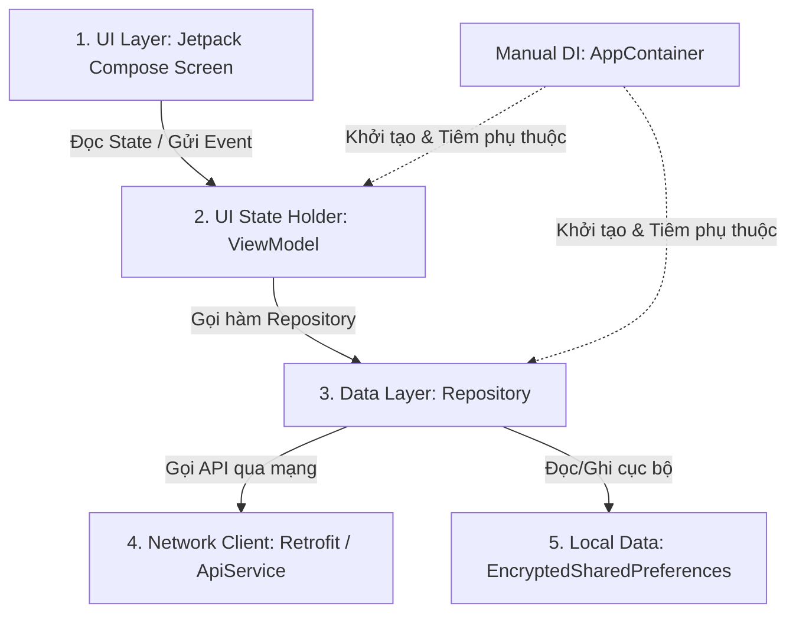

# Hướng dẫn Kiến trúc Frontend & Quy trình tích hợp API trong LearnVerse

Tài liệu này cung cấp cái nhìn tổng quan về kiến trúc mã nguồn Android của LearnVerse (sử dụng **Jetpack Compose + MVVM + Repository Pattern + Manual DI**) và hướng dẫn từng bước để bạn tự thêm một API mới và hiển thị kết quả lên giao diện.

---

## 1. Tổng quan Kiến trúc Frontend

Ứng dụng của chúng ta tuân thủ mô hình kiến trúc sạch khuyến nghị bởi Google, phân chia thành 3 lớp chính:



### Chi tiết các thành phần:

*   **UI Layer (Jetpack Compose Screen)**:
    *   Nơi vẽ giao diện sử dụng các `@Composable` function.
    *   Nhận dữ liệu thông qua việc quan sát `StateFlow` từ ViewModel bằng hàm `.collectAsState()`.
*   **ViewModel (State Flow / State Holder)**:
    *   Giữ trạng thái UI trong một data class duy nhất (ví dụ: `HomeUiState`).
    *   Nhận tương tác từ UI (events) và thực hiện logic xử lý dữ liệu trong `viewModelScope.launch`.
    *   Gọi các phương thức của Repository.
*   **Data Layer (Repository)**:
    *   Đóng vai trò là cầu nối dữ liệu duy nhất của ứng dụng.
    *   Repository Interface định nghĩa các phương thức nghiệp vụ.
    *   DefaultRepository (Implementation class) triển khai phương thức, gọi dữ liệu từ API hoặc Local Storage (`TokenManager`).
    *   Sử dụng `runCatching` để đóng gói kết quả thành kiểu `Result<T>` (giúp quản lý lỗi Exception dễ dàng).
*   **AppContainer (Dependency Injection)**:
    *   Hỗ trợ tiêm phụ thuộc thủ công (Manual Dependency Injection) mà không cần dùng thư viện phức tạp như Hilt/Dagger.
    *   Mọi Repository và ApiService đều được khởi tạo một lần (Singleton-like) trong `DefaultAppContainer` thông qua từ khóa `by lazy`.

---

## 2. Quy trình Gọi API và Hiển thị kết quả lên UI

Để thêm một API mới và hiển thị dữ liệu lên màn hình, bạn hãy thực hiện theo đúng **6 bước** dưới đây:

### Bước 1: Định nghĩa Data Model (DTO)
Tạo hoặc bổ sung lớp dữ liệu Kotlin để map với JSON trả về từ backend.
*   *Đường dẫn mẫu:* `frontend/app/src/main/java/com/vku/learnverse/data/model/`

```kotlin
import com.google.gson.annotations.SerializedName

data class CourseDto(
    @SerializedName("id") val id: Long,
    @SerializedName("title") val title: String,
    @SerializedName("description") val description: String?,
    @SerializedName("status") val status: String
)
```

### Bước 2: Khai báo API Endpoint trong `ApiService`
Thêm hàm gọi API sử dụng các Annotation của Retrofit.
*   *Đường dẫn tệp:* [ApiService.kt](file:///d:/OhhhMyVenuss/LearnverseV2/frontend/app/src/main/java/com/vku/learnverse/data/api/ApiService.kt)

```kotlin
import retrofit2.http.GET

interface ApiService {
    // Thêm endpoint của bạn ở đây
    @GET("courses/approved")
    suspend fun getApprovedCourses(): List<CourseDto>
}
```

### Bước 3: Cập nhật Repository để gọi API
1. Thêm phương thức trong **Repository Interface**:
   * *Ví dụ:* [CourseRepository.kt](file:///d:/OhhhMyVenuss/LearnverseV2/frontend/app/src/main/java/com/vku/learnverse/data/repository/CourseRepository.kt)
   ```kotlin
   interface CourseRepository {
       suspend fun getApprovedCourses(): Result<List<CourseDto>>
   }
   ```
2. Triển khai trong **DefaultRepository**:
   * *Ví dụ:* [DefaultCourseRepository.kt](file:///d:/OhhhMyVenuss/LearnverseV2/frontend/app/src/main/java/com/vku/learnverse/data/repository/DefaultCourseRepository.kt)
   ```kotlin
   class DefaultCourseRepository(private val apiService: ApiService) : CourseRepository {
       override suspend fun getApprovedCourses(): Result<List<CourseDto>> = runCatching {
           apiService.getApprovedCourses()
       }
   }
   ```

*(Lưu ý: Nếu bạn tạo một Repository mới hoàn toàn, bạn cần vào [AppContainer.kt](file:///d:/OhhhMyVenuss/LearnverseV2/frontend/app/src/main/java/com/vku/learnverse/data/di/AppContainer.kt) để khai báo thuộc tính và khởi tạo tương ứng).*

### Bước 4: Viết ViewModel để quản lý UI State
1. Định nghĩa **UI State Class**:
   ```kotlin
   data class CourseUiState(
       val isLoading: Boolean = false,
       val courses: List<CourseDto> = emptyList(),
       val errorMessage: String? = null
   )
   ```
2. Tạo **ViewModel** gọi Repository:
   ```kotlin
   class CourseViewModel(private val courseRepository: CourseRepository) : ViewModel() {
       private val _uiState = MutableStateFlow(CourseUiState())
       val uiState: StateFlow<CourseUiState> = _uiState.asStateFlow()

       init {
           fetchCourses()
       }

       fun fetchCourses() {
           viewModelScope.launch {
               _uiState.value = _uiState.value.copy(isLoading = true, errorMessage = null)
               
               courseRepository.getApprovedCourses()
                   .onSuccess { data ->
                       _uiState.value = CourseUiState(isLoading = false, courses = data)
                   }
                   .onFailure { exception ->
                       _uiState.value = CourseUiState(isLoading = false, errorMessage = exception.message)
                   }
           }
       }

       // Khai báo Factory để tiêm Repository từ AppContainer vào ViewModel
       companion object {
           val Factory: ViewModelProvider.Factory = viewModelFactory {
               initializer {
                   val app = (this[APPLICATION_KEY] as LearnverseApplication)
                   CourseViewModel(courseRepository = app.container.courseRepository)
               }
           }
       }
   }
   ```

### Bước 5: Gọi dữ liệu và Render giao diện (Jetpack Compose)
Tạo UI Screen và quan sát `uiState` để vẽ giao diện động theo từng trạng thái.

```kotlin
@Composable
fun CourseScreen(
    viewModel: CourseViewModel = viewModel(factory = CourseViewModel.Factory)
) {
    val uiState by viewModel.uiState.collectAsState()

    Box(modifier = Modifier.fillMaxSize()) {
        if (uiState.isLoading) {
            // 1. Hiển thị vòng xoay đang tải
            CircularProgressIndicator(modifier = Modifier.align(Alignment.Center))
        } else if (uiState.errorMessage != null) {
            // 2. Hiển thị lỗi nếu gọi API thất bại
            Text(
                text = "Lỗi: ${uiState.errorMessage}",
                color = Color.Red,
                modifier = Modifier.align(Alignment.Center)
            )
        } else {
            // 3. Hiển thị danh sách kết quả khi thành công
            LazyColumn {
                items(uiState.courses) { course ->
                    Text(text = course.title, modifier = Modifier.padding(16.dp))
                }
            }
        }
    }
}
```

---

## 3. Một số Quy tắc & Lưu ý quan trọng khi code

1. **Không thực hiện tác vụ nặng trên Main Thread**:
   * Mọi hàm API trong `ApiService` phải có từ khóa `suspend` để Retrofit tự động chạy bất đồng bộ dưới background thread.
2. **Quản lý Token tự động**:
   * Client Retrofit đã được tích hợp sẵn Interceptor tự động đính kèm `Bearer Token` từ `TokenManager` vào tiêu đề của mỗi request. Bạn không cần phải đính kèm thủ công trong `ApiService`.
3. **Luôn xử lý Trường hợp lỗi**:
   * Luôn bọc các hàm gọi API trong `runCatching` của Repository và kiểm tra kết quả bằng `.onSuccess {}` / `.onFailure {}` ở ViewModel nhằm ngăn chặn ứng dụng bị crash đột ngột khi mất kết nối mạng.
